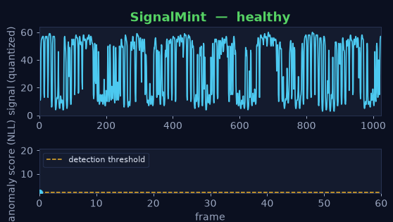

<h1 align="center">SignalMint</h1>

<p align="center">
  <b>One tiny INT8 model. Two products.</b><br/>
  Label-free <b>anomaly detection</b> and neural <b>compression</b> for 1-D edge signals —
  small enough for a microcontroller.
</p>

<p align="center">
  <a href="https://github.com/Charan-Hari/SignalMint/actions/workflows/ci.yml"></a>
  
  
  
</p>

<p align="center"><i>Learn normal · Compress better · Detect earlier · Run anywhere</i></p>

<p align="center">
  
</p>

<p align="center">
  A healthy vibration signal streams by with a live anomaly score. When the bearing
  develops a fault, the score jumps over the threshold — <b>with no labeled failure data</b>.
</p>

---

## Why SignalMint

An autoregressive model outputs an explicit **probability for every sample** it sees.
That single property yields two products from the **same** trained model:

- **🔍 Label-free anomaly detection** — improbable samples (high negative log-likelihood)
  are anomalies. No labeled failure data required, which is exactly what the
  predictive-maintenance market is stuck on.
- **🗜️ Neural compression** — the same probabilities drive an entropy coder.
  "Predict the next sample well" is mathematically identical to "send fewer bits",
  so the model doubles as a codec for bandwidth-constrained links.

See [docs/thesis.md](docs/thesis.md) for the full positioning and target market.

## Table of contents
- [Results](#results)
- [Quickstart (30 seconds)](#quickstart-30-seconds)
- [How it works](#how-it-works)
- [Install as a package](#install-as-a-package)
- [Target tier](#target-tier)
- [Status](#status)

## Results

On real **CWRU bearing-vibration** data — an 8-layer WaveNet-lite (64 bins,
~68 K INT8 params), trained on healthy data only. Full numbers in
[docs/BENCHMARKS.md](docs/BENCHMARKS.md).

| Capability | SignalMint | Baseline |
| --- | --- | --- |
| **Anomaly** — ROC AUC / detection @1% FA | **1.000 / 1.000** | autoencoder 1.000 / 1.000 |
| **Compression** — bits/sample | **2.89** | gzip 4.73 · order-0 5.34 · uniform 6.00 |
| **Edge footprint** | **110 KB ROM · 33 KB RAM** · 65 K MACs/sample | — |
| **INT8 C-runtime parity** | **bit-exact** (max abs diff 0) | — |

- **1.64× smaller than gzip** and 2.07× smaller than a fixed-width code — with an **exact round-trip** (~52% fewer bytes on the wire).
- The **same model** flags anomalies with **no labeled failures**.
- Fits cheap MCUs with **length-independent** streaming RAM and no cloud dependency.

## Quickstart (30 seconds)

No dataset download, no pretrained checkpoint — 8 sample signals ship in
[`samples/`](samples/).

```bash
python -m venv .venv && source .venv/bin/activate   # Windows: .\.venv\Scripts\Activate.ps1
pip install -e ".[train,dev]"

python scripts/try_samples.py
```

You'll get a table like:

```
sample                    type           score     verdict   bits/sample
--------------------------------------------------------------------------
01_normal_1797rpm         normal         2.925      normal      4.22 b/s
04_inner_race_fault       inner_race     3.169     ANOMALY      4.57 b/s
05_ball_fault             ball           3.238     ANOMALY      4.67 b/s
06_outer_race_fault       outer_race     3.141     ANOMALY      4.53 b/s
08_severe_fault           severe         3.287     ANOMALY      4.74 b/s
```

It trains a tiny model on the **healthy** samples only, then scores every signal
for anomaly and reports its compression rate. See [samples/README.md](samples/README.md).

Prefer a notebook? Open [notebooks/demo.ipynb](notebooks/demo.ipynb).

## How it works

One streaming, **causal** model feeds three heads. Because it is causal, the exact
same computation runs as a bounded-memory streaming pass on a microcontroller.

```
   Raw 1-D signal
        |
  [ framing + mu-law quantization to N bins ]     (INT8-friendly)
        |
  [ WaveNet-lite: dilated causal convs, INT8 ]
        |  P(next sample | past)
        +----------------+------------------+
   Likelihood        Entropy coder       Sampler
   (NLL score)       (arithmetic)        (optional)
        |                 |                  |
   ANOMALY score    COMPRESSED bits    synthetic / infill
```

The INT8 model is exported to a dependency-free **C runtime** whose integer
arithmetic is **bit-exact** with the Python reference (verified in CI).

<details>
<summary><b>Full pipeline (reproduce every number)</b></summary>

```bash
python scripts/train.py         --source cwru --epochs 12       # -> artifacts/model.pt
python scripts/evaluate.py      --checkpoint artifacts/model.pt # anomaly + compression
python scripts/export_c.py      --checkpoint artifacts/model.pt # -> runtime/model_data.h
python scripts/parity.py        --checkpoint artifacts/model.pt # bit-exact C parity
python scripts/edge_report.py   --checkpoint artifacts/model.pt # ROM/RAM/latency/energy
python scripts/benchmark.py     --source cwru                   # everything -> docs/BENCHMARKS.md
python scripts/make_demo_gif.py --checkpoint artifacts/model.pt # docs/demo.gif
```

`pip install -e .` (core) pulls only NumPy/SciPy; PyTorch is the optional `train`
extra so the eval/runtime paths stay light.

</details>

<details>
<summary><b>Project structure</b></summary>

```
signalmint/        Python package
  data/            CWRU adapter (+ synthetic fallback), framing, quantization
  model/           WaveNet-lite dilated causal-conv model
  anomaly/         NLL scoring, metrics, autoencoder baseline
  compress/        arithmetic coder + neural codec + baselines
  quantize/        INT8 export, integer reference, C parity, footprint
runtime/           dependency-free C runtime (bit-exact with Python)
scripts/           train / evaluate / export / parity / benchmark / try_samples
samples/           8 ready-to-run signals (healthy + fault types)
tests/             pytest suite (incl. INT8 C parity)
docs/              thesis, benchmarks, edge report, landing page
notebooks/         demo.ipynb
```

</details>

## Install as a package

```bash
pip install -e ".[train]"          # editable, from source
# or build distributables:
python -m build                    # -> dist/signalmint-*.whl and *.tar.gz
```

Tagging a release (`git tag v0.1.0 && git push --tags`) builds the wheel/sdist and
attaches them to a GitHub Release automatically (see `.github/workflows/release.yml`).

## Target tier

| Parameter | Choice |
| --- | --- |
| Memory / RAM | 1–8 MB |
| Power | sub-100 mW active |
| Precision | INT8 weights/activations |
| Modality | 1-D signals (vibration / audio / telemetry) |
| Deployment | software on dev boards first; silicon co-design later |

## Status

All phases complete: scaffold → data + model → both heads → INT8 C runtime
(bit-exact) → edge report → packaging. **54 tests** pass in CI across Python
3.11–3.13.

## Acknowledgements & disclaimer

Benchmarks use the [CWRU Bearing Data Center](https://engineering.case.edu/bearingdatacenter)
dataset (downloaded on demand). The bundled `samples/` are generated by this
project's own synthetic generator. Results are on a curated CWRU subset; energy
figures are modeled estimates with stated assumptions.

## License

MIT — see [LICENSE](LICENSE).
